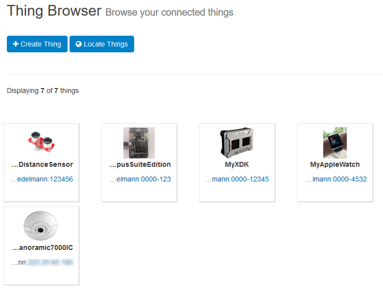
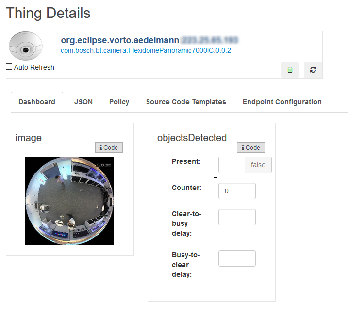

# Connecting Bosch Security Cameras to the Bosch IoT Suite 

This Vorto Camera Connector takes care of integrating Bosch security cameras with the Bosch IoT Suite. It essentially reads the camera's binary data, normalizes it to a semantic domain model and forwards this data to Bosch IoT Suite via MQTT. A solution can now easily read the camera data from Bosch IoT Things and process it.
The connector supports all cameras having people detection - and image-snapshot capabilities.
The capabilities are defined as Vorto Function Blocks. 

The following 2 camera types are available in the Vorto Repository and work out-of-the-box with this connector. But it is very easy to plug-in other types of cameras and make it work with this connector (Please refer to section "Extending the Vorto Connector")

* [Flexidome Panoramic](https://vorto.eclipse.org/#/details/com.bosch.bt.camera:FlexidomePanoramic7000IC:0.0.2) 
* [Dinion](https://vorto.eclipse.org/#/details/com.bosch.bt.camera:DinionIPStarlight8000MP:0.0.1)

Here is a short youtube video about the integration: [Link to Video](https://www.youtube.com/watch?v=P6m-6NMoN_Y&feature=youtu.be)

## Prerequisite

* Bosch ID Account
* Subscription to Asset Communication for Bosch IoT Suite (Free plan, no credit card required)

* Tools
	* IDE
	* Git
	* Maven

* Hardware
	* Flexidome or Dinion Camera (providing image-snapshot and people detection cababilities)

## Steps to follow

This step by step explains how to connect a Bosch Flexidome camera to Bosch IoT Suite using this connector:

### Step 1: Register camera in the Bosch IoT Suite

1. Login to https://vorto.eclipse.org/console with your Bosch ID
2. Register camera instance in the Bosch IoT Suite. For this click **Create thing**
	* Select **FlexidomePanoramic7000IC** and hit 'Next'
	* Specify the namespace of your booked IoT Things instance, e.g. org.mycompany. This namespace must match with the one you have configured via the Bosch IoT Things Dashboard! Check the namespace of your Bosch Iot Things by clicking the **Dashboard** link under your Service Subscriptions and navigating to **Namespace** tab.
	* Specify the IP Address of the camera, e.g. 62.4.2.1. Hit 'Next'
	* Specify the password for the device and hit 'Next'
	* Review your settings and hit 'Create'. This will register your camera in the Bosch IoT Suite.
3. Change to the **Thing Browser**. You should be able to see your newly created camera thing:

### Step 2: Configure the connector for your solution

1. Clone https://github.com/bsinno/iot-suite-console.git
2. Check out branch **master**
3. Open **application.yml** and add your Asset Communication package solution parameters, specifically for hono/hub:

		hono:
		  mqttEndpoint: ssl://mqtt.bosch-iot-hub.com:8883
  	  	  tenant: 
          registryEndpoint: https://manage.bosch-iot-hub.com
          registryUsername: 
          registryPassword: 
          devicePassword:     

### Step 3: Configure Connector for Flexidome Camera

1. Open Config Class **ApplicationConfiguration.java** and add the registered device ID as well as port of the camera.

		@Bean
		public SourceTracker sourceTracker() {
			SourceTracker sourceTracker = new SourceTracker();
			sourceTracker.addToTracker(SourceContext.newSource("DeviceID, as registered in Console, EG 62.4.2.1",10800));
			return sourceTracker;
		}

2. Download the Hub Server Certificate https://docs.bosch-iot-hub.com/cert/iothub.crt and store it under src/main/resources/certs/iothub.crt

### Step 4: Run the Connector

1. Run the application as a Spring Boot App

Once the app starts up, you should be able to see synchronization messages that reads the camera data and sends it to the Bosch IoT Suite every 5 seconds. 

### Step 6: Verify camera data in Bosch IoT Things

1. Open the Vorto Console https://vorto.eclipse.org/console
2. Open the details page of your registered camera and verify if the incoming data:

## Extending the Vorto Connector 

TBD
