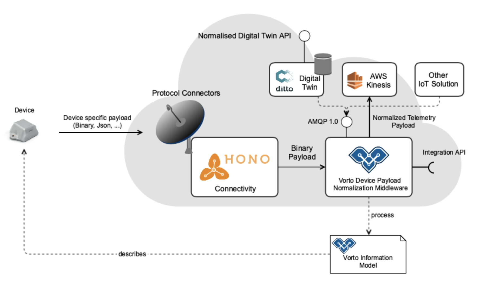

# Getting Started with the Eclipse Vorto Semantic Normalizer middleware

**Motivation**

In IoT, devices send their data in various formats to IoT cloud platforms, ie. as JSON, CSV, binary or others. You can imagine, that this requires a lot of integration logic development in the platform, such as preparing the payload in a way, that components can easily process the device messages. 


**What is the Eclipse Vorto Semantic Normalizer middleware?**

The Eclipse Vorto Semantic Normalizer middleware is a lightweight, stateless micro service that normalizes device telemetry messages to a semantic model, that is defined as [Vorto Information Models](https://github.com/eclipse/vorto/blob/master/docs/vortolang-1.0.md). The core of the middleware is the [Vorto Mapping Engine](https://github.com/eclipse/vorto/blob/master/mapping-engine/Readme.md), a tiny runtime component, that applies Vorto Mapping Specifications to the device data, in order to output semantic, normalized data models. Mapping Specifications can be created easily using the [Eclipse Vorto Web Editors](https://vorto.eclipse.org)
The middleware essentially wraps the mapping engine in a spring-boot application, creating a very efficient device telemetry data mapping pipeline.  
In order to customize the middleware to your requirements, an extension point (API) is provided, that lets you easily implement middleware plugins. These plugins are able to process the normalized device payload, such as forwarding it to AWS IoT Shadow Service or a Streaming analytics engine. 

In a micro-service architecture, services communicate asynchronously via AMQP. Therefore, the middleware also uses AMQP technology to receive device messages from Eclipse Hono, and publishes normalized, semantic payload as an AMQP topic. To avoid confusion, the middleware itself, is not an AMQP server, but rather an AMQP client that is able to publish the normalized device messages to any AMQP message broker, e.g. Amazon MQ. 
  
Please follow [this link](https://github.com/eclipse/vorto/blob/development/docs/tutorials/create_mapping_pipeline.md) to use the Vorto Normalizer middleware for a simple IoT geolocation use case.

  

  

  



  

  

  

## Vorto Normalizer Frontend

  

  

  

The Eclipse Vorto Middleware Frontend is an additional lightweight Angular 8 application, able to visualize the in-and outbounding device payload as well as listing the configured plugins. You can see a running example of what to expect under [this link](http://vorto-middleware.eu-central-1.elasticbeanstalk.com/)

  

  

  


  

  

  

# Running the middleware service

  

  

You can run the Vorto Normalizer service and frontend out of the box via **Docker**. Thus, getting started is as easy as downloading each of the container from the docker hub and running them as described in the following:

  

  

## **Running the Vorto Normalizer Service**

**Downloading the image:**

1. Pull the image from docker hub:

	 `docker pull eclipsevorto/vorto-normalizer:nightly`

2. Run the image:


**Running the image:**

To run the middleware, you need to set the following environment variables:

*  **-e hono.tenantId=**  _Eclipse Hono tenant ID, for receiving device telemetry messages_

*  **-e hono.password=**  _Eclipse Hono messaging password, for receiving device telemetry messages_

*  **-e amqp.url=**  _AMQP 1.0 Broker url, for the middleware to publish normalized device payload to_

*  **-e amqp.username=**  _AMQP 1.0 Broker username for authentication_

*  **-e amqp.password=**  _AMQP 1.0 Broker password for authentication_

*  **-e cors=**  _Cross-Origin Resource Sharing (CORS) url, optional for connection to e.g the middleware ui_

Start the image via e.g:

`docker run -it -p 8080:8080 -e hono.tenantId=your_tenantId -e hono.password=your_hono_password -e amqp.url=amqp_url -e amqp.username=amqp_username -e amqp.password=amqp_password -e cors=http://localhost:4200 eclipsevorto/vorto-normalizer:nightly`


**Adding your mapping specifications to the middleware**

In order to configure the normalizer middleware with your mapping specifications, you can simply mount a docker volume via `-v` and then point the middleware to this mounted directory, where it can find all mappings. 

The following variables need to be passed when running the middleware docker container:

* **-v** _/absolute_local_directory_path:/directory_path_on_image_

*  **-e mapping_spec_dir**  _Path in the docker container, including your custom mappings as defined on the right side of the volume parameter (`directory_path_on_image`) in the previous command. It can e.g be named to /mappings_


**Please note that `absolute_local_directory_path` has to be an absolute path in respect to the directory and operating system you are running the `docker run` command in.**

Here is an example how we can mount a volume with the directory ```mappings``` when running ```docker run```:

`docker run -it -v //C/absolute_local_dir:/mappings -p 8080:8080   
-e mapping_spec_dir=/mappings -e hono.tenantId=your_tenantId -e hono.password=your_hono_password -e amqp.url=amqp_url -e amqp.username=amqp_username -e amqp.password=amqp_password -e cors=http://localhost:4200 eclipsevorto/vorto-normalizer:nightly`


## **Running the middleware frontend**

**Downloading the image:**

1. Pull the image from docker hub:

`docker pull eclipsevorto/vorto-normalizer-ui:nightly`

**Running the image:**  

3. Run the image:

`docker run -p 4200:4200 eclipsevorto/vorto-normalizer-ui:nightly`


## What's next ?


*  [Read tutorial](https://github.com/eclipse/vorto/blob/development/docs/tutorials/create_mapping_pipeline.md), that uses the Vorto Semantic Middleware for an IoT Geolocation use case

* Read more about the [Vorto Mapping Engine](https://github.com/eclipse/vorto/blob/development/mapping-engine/Readme.md), the core of the Vorto Semantic Middleware
